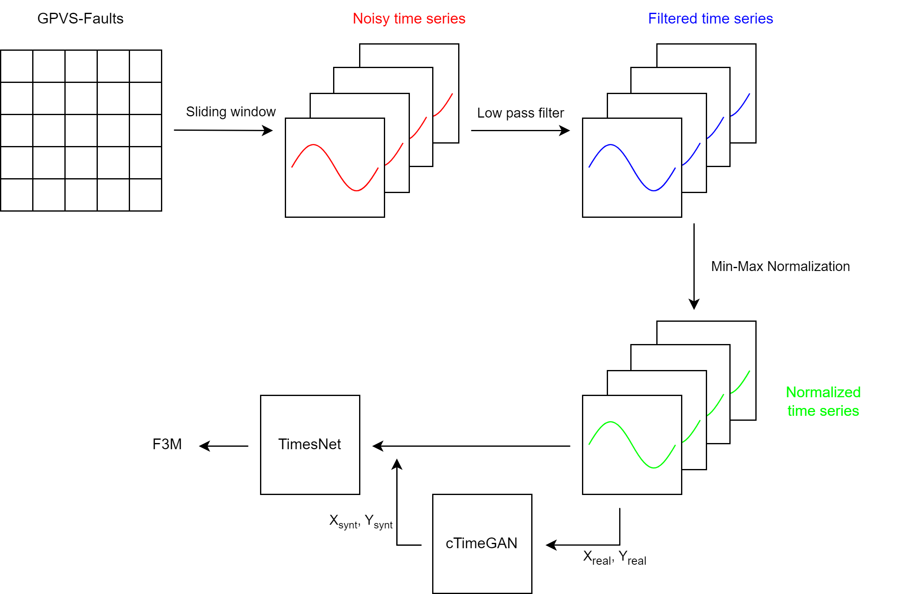

# Anomaly Detection in GPVS

## Table of Contents
- [Introduction](#introduction)
- [Overview](#overview)
- [Features](#features)
- [Data](#data)
- [Models](#models)
- [Evaluation](#evaluation)
- [Usage](#usage)

## Introduction

Anomaly Detection in Grid-connected Photovoltaic Systems (GPVS) is crucial for optimizing performance, efficiency, and system longevity. This repository presents a time series-based approach to PV anomaly detection.

## Overview

This project focuses on the detection of anomalies in PV systems using innovative machine learning models. The primary models include TimesNet and LSTM-FCN, designed specifically for time series data. The project addresses challenges like data imbalances, dynamic system behavior, and real-time monitoring.

## Features

- Utilizes time series data to capture temporal patterns in PV system behavior.
- Offers advanced models like TimesNet and LSTM-FCN for anomaly detection.
- Provides solutions for imbalanced data in the anomaly detection process.

## Data

The project uses the GPVS-Faults dataset, a valuable resource for PV anomaly detection.
You can access the GPVS-Faults dataset [here](https://data.mendeley.com/datasets/n76t439f65/1). For more information about the dataset, please refer to the documentation provided with the dataset.

### Data Preprocessing

Before utilizing the dataset for anomaly detection, it's essential to prepare the data. The project includes the following data preprocessing techniques:

- **Sliding Window**: Sliding window techniques are applied to segment original data into overlapping or non-overlapping time series. This enables the models to capture temporal patterns effectively.

- **Low Pass Filter**: Low pass filtering is used to remove high-frequency noise and fluctuations from the time series data. It helps in obtaining a smoother representation of the PV system's behavior.

- **Min-Max Normalization**: Min-Max normalization is applied to scale the data to a specific range, typically [0, 1]. This ensures that all features have a similar influence on the model and prevents bias due to different scales.

### Balancing Techniques

One challenge in anomaly detection is dealing with imbalanced data, where normal instances significantly outnumber anomalies. To address this challenge, the project employs two balancing techniques:

- **Oversampling**: Oversampling is a technique that increases the representation of the minority class by duplicating or generating more samples from it. This ensures a more balanced dataset for training.

- **GAN Data Augmentation**: Conditional Generative Adversarial Networks (cGANs) are used to generate synthetic samples of the minority class. GAN data augmentation is an effective way to balance the dataset while introducing realistic variations.

These preprocessing and balancing techniques contribute to improved model performance, particularly in scenarios with imbalanced class distributions.

## Models

The project offers two primary models for PV anomaly detection:

- **TimesNet**: A deep learning model designed to capture time series patterns in PV data. This model is particularly effective in identifying temporal anomalies. You can access the TimesNet model repository [here](https://github.com/vincenzodr/Time-Series-Library) for more information, code, and documentation.

- **LSTM-FCN**: A hybrid model that combines Long Short-Term Memory (LSTM) and Convolutional layers, providing a versatile approach to anomaly detection in PV systems.

## Evaluation

We employ evaluation metrics to assess the performance of the anomaly detection models. These metrics include:

- **Precision**: The proportion of true positive predictions out of all positive predictions.
- **Recall**: The proportion of true positive predictions out of all actual positive instances.
- **F1-Score**: The harmonic mean of precision and recall, providing a balanced assessment of model performance.
- **Accuracy**: The proportion of correct predictions out of all predictions made.

## Usage

To use this project, follow these steps:

1. **Download the Dataset**: Start by downloading the dataset from the provided link. You can access the GPVS-Faults dataset [here](https://data.mendeley.com/datasets/n76t439f65/1).

2. **Data Preprocessing**: Use the notebook [gpvs-npy.ipynb](https://github.com/vincenzodr/AnomalyDetectionGPVS/blob/main/Dataset/gpvs-npy.ipynb) to preprocess the dataset. This notebook will handle essential data preprocessing steps, including sliding window and low pass filtering.

3. **Train GAN Model**: Employ the notebook [conditionaltimegan.ipynb](https://github.com/vincenzodr/AnomalyDetectionGPVS/blob/main/GAN/conditionaltimegan.ipynb) to train the Generative Adversarial Network (GAN) model. This model plays a crucial role in generating synthetic data to balance the dataset.

4. **Generate Synthetic Data**: After training the GAN model, use the notebook [generate-gan-data.ipynb](https://github.com/vincenzodr/AnomalyDetectionGPVS/blob/main/GAN/generate-gan-data.ipynb) to generate synthetic data. This step helps balance the dataset by creating additional samples of the minority class.

5. **Split Dataset**: Utilize the notebook [gpvs_gan.ipynb](https://github.com/vincenzodr/AnomalyDetectionGPVS/blob/main/Dataset/gpvs_gan.ipynb) to split the dataset into training, validation, and test sets. This step ensures that you have well-organized data for training and evaluating your models.

6. **Train and Test the Model**: Choose the model of your preference, whether it's LSTM-FCN or TimesNet, and use the respective notebook, either [lstm-fcn.ipynb](https://github.com/vincenzodr/AnomalyDetectionGPVS/blob/main/lstm-fcn.ipynb) or [timesnet-classification.ipynb](https://github.com/vincenzodr/AnomalyDetectionGPVS/blob/main/timesnet-classification.ipynb), to train and test the selected model on the preprocessed and balanced dataset.

